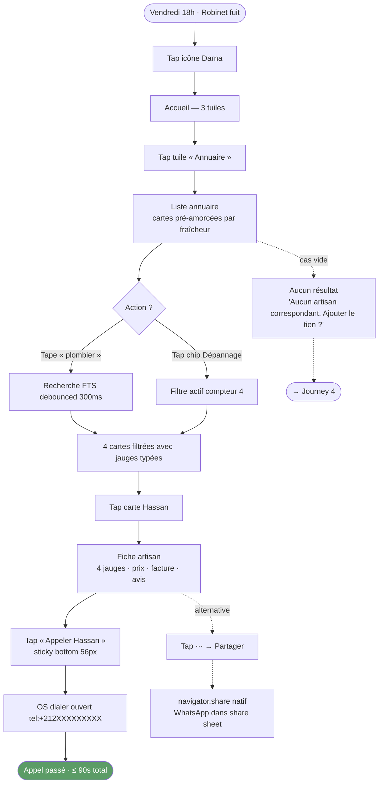
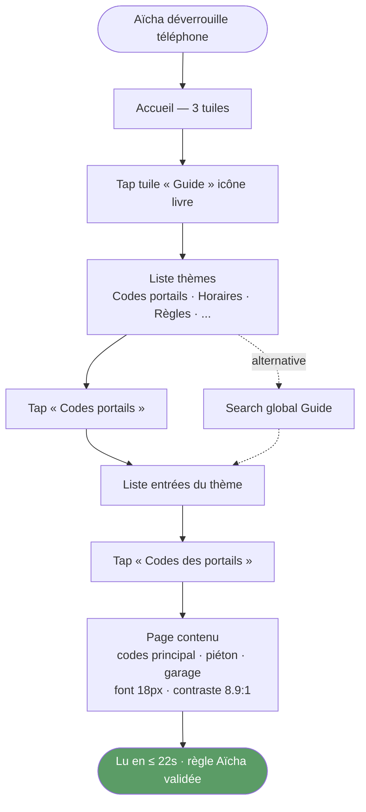
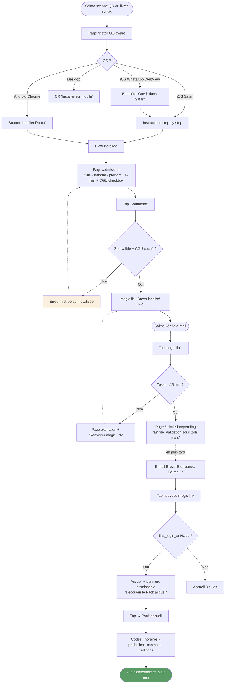
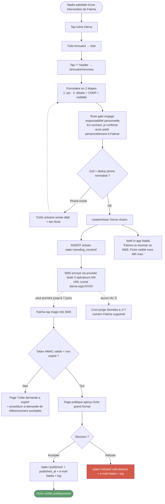
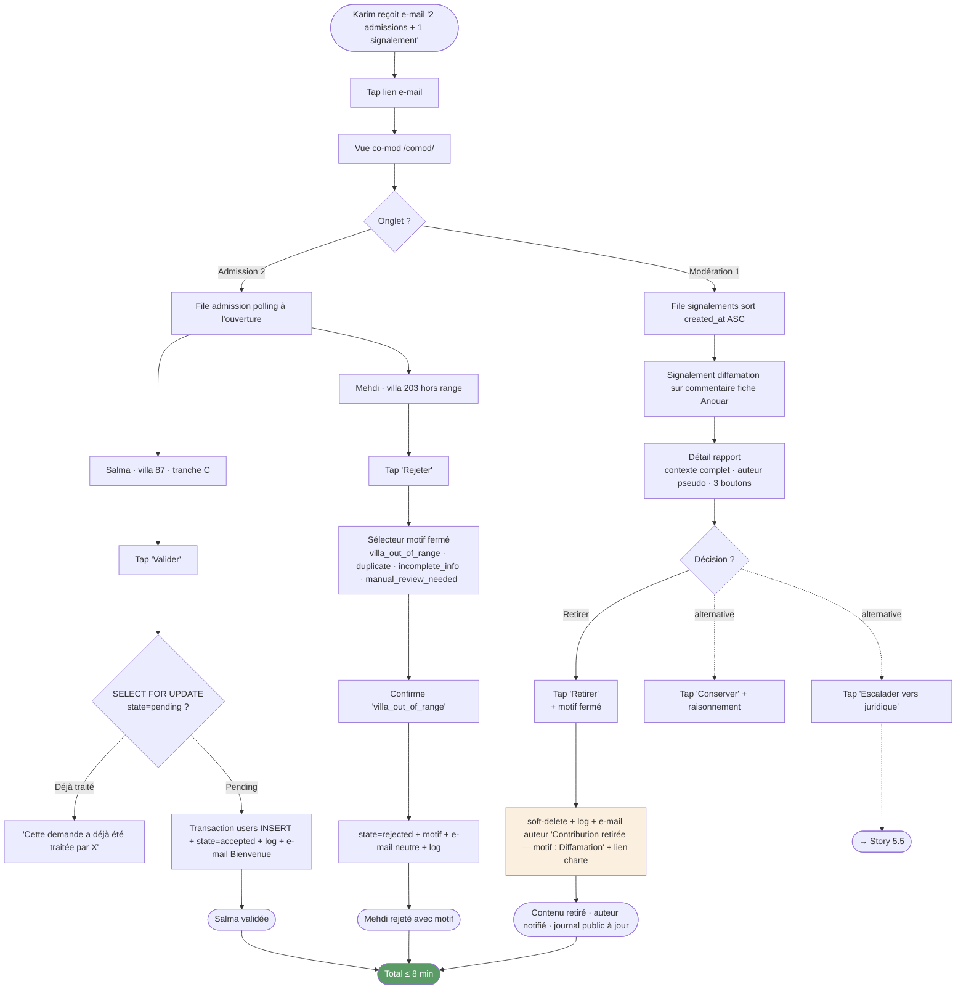

# UX Design Specification — Darna

**Auteur :** Stephane Henry
**Date :** 2026-05-23
**Projet (codename repo) :** SmartResidence
**Nom public :** Darna (دارنا)

<!-- Contenu UX ajouté séquentiellement par les étapes du workflow -->

## Executive Summary

### Project Vision

Darna est une PWA communautaire pour 150 villas d'une résidence marocaine, conçue comme un commun numérique de quartier (open source MIT, gratuit, sans store, sans monétisation). Elle transforme la mémoire dispersée des conversations WhatsApp en un référentiel structuré, chercheable et partageable. Le killer feature est un annuaire d'artisans noté par les voisins en notation typée 4 axes (Dépannage / Petits travaux / Travail soigné / Urgences), en français au MVP, avec workflow de consentement artisan CNDP-compliant. La cible de lancement est début juillet 2026.

**Internationalisation** : MVP FR-only. L'arabe (RTL) est différé en V1.5. La structure technique reste prête (CSS logical properties, next-intl à 1 locale active, `dir` neutre).

### Target Users

Six personas terrain dont 5 actifs au MVP :

- **Aïcha** (72 ans, 1ʳᵉ génération mobile) — standard ergonomique non-négociable. Règle Aïcha : toute fonctionnalité MVP exécutable en ≤ 30 secondes sans aide. P1.
- **Yassine** (38 ans, cadre télétravailleur) — recherche efficace en ≤ 5 secondes. P3.
- **Karim & Salma** (30 ans, jeune couple nouvellement emménagé) — onboarding incarné, découverte de la résidence en 10 min. P2.
- **Nadia** (35 ans, maman solo) — contributrice méfiante de l'exposition publique. Test ultime de confiance. P5.
- **Karim co-mod** (45 ans, bâtisseur communautaire) — admin volontaire ~2h/mois, ergonomie pro pour modération rapide. P4.

Mohamed gardien est explicitement hors-MVP pour préserver la pureté horizontale habitants-pour-habitants.

**Note langue** : tous les personas MVP sont supposés francophones suffisants. La validation bêta confirmera si Aïcha utilise Darna en français sans frein.

### Key Design Challenges

1. **Double contrainte ergonomique Aïcha/Yassine** — concilier profondeur zéro (3 tuiles d'accueil, 1 niveau max) et efficacité brute. Patterns familiers WhatsApp (NFR40b « geste = WhatsApp ») comme socle commun.
2. **Notation typée 4 axes** (Innovation 3 PRD) — jamais prototypée, doit tenir en ≤ 30 secondes pour Aïcha. Risque ergonomique critique à valider en pré-bêta.
3. **Workflow consentement artisan asynchrone** — Nadia ne doit pas se sentir exposée, l'artisan ne doit pas décrocher du SMS magic link, validation en 1 tap sans création de compte.
4. **Cohabitation WhatsApp formalisée** — copie URL canonique en 1 tap (pas de modal intermédiaire), deep link qui ouvre la PWA si installée, capture contexte pré-login pour visiteur arrivant via lien partagé.
5. **Page `/install` OS-aware** — Safari iOS sans prompt natif, instructions step-by-step + détection in-app browser WhatsApp avec consigne « ouvrir dans Safari ».
6. **Transparence radicale de la modération** — journal public lisible par tout visiteur, codage visuel qui informe sans stigmatiser.
7. **Anticipation propre de V1.5 (AR/RTL)** — CSS logical properties, `next-intl` structuré, copies dans dictionnaires plutôt que hardcodées, slugs et tags conçus pour accueillir AR ultérieurement sans refactor de fond.

### Design Opportunities

1. **Pattern « Geste = WhatsApp »** (NFR40b) — micro-interactions familières (compose-action-envoyer, modèles 1-tap, partage natif via `navigator.share`) rendant Darna immédiatement opérationnel sans onboarding obligatoire.
2. **Densité utile dès le J1** (Innovation 4 PRD) — l'annuaire pré-amorcé par les co-mods donne une UI dense au lancement public, pas un état vide. Mise en scène visuelle de cette valeur immédiate.
3. **Iconographie universelle** — icônes qui parlent indépendamment de la lecture (clé à molette, cloche, livre, maison), forte affinité culturelle Maghreb sans dépendance à une langue.
4. **Notation typée comme signature visuelle** — 4 jauges colorées par axe sur la fiche artisan plutôt qu'un seul score étoile générique, lisible en 1 coup d'œil et différencie de tout concurrent du segment.

## Core User Experience

### Defining Experience

L'action centrale de Darna est _« j'ai une question pratique → j'ouvre Darna → je trouve la réponse en ≤ 5 secondes → je passe à l'action »_. Variante quotidienne : Yassine cherche un plombier. Variante critique : Aïcha cherche le code du portail. Variante onboarding : Salma découvre la résidence via le Pack accueil. Toutes partagent le même invariant — trouver vite, sans frottement, sans réapprendre.

La contribution (Nadia poste une fiche artisan, un résident publie une alerte) est plus rare mais conditionne la valeur de la consommation. Le design minimise la friction de contribution sans trivialiser les gates CNDP nécessaires.

### Platform Strategy

| Axe                      | Décision                                                                                                                                          |
| ------------------------ | ------------------------------------------------------------------------------------------------------------------------------------------------- |
| Type                     | PWA installable (SPA). Pas d'app native, pas de store (rejet idéologique permanent).                                                              |
| Terminal principal       | Smartphone (≥ 95 % du trafic attendu). Tablet et desktop = fallbacks fonctionnels co-mods.                                                        |
| OS/Navigateurs primaires | iOS Safari 15+ et Android Chrome 95+. Firefox/Edge desktop en secondaire pour co-mods.                                                            |
| Mode d'interaction       | Tactile dominant. Clavier intégral en a11y (NFR37). Pas de hover-only.                                                                            |
| Offline                  | Lecture entièrement hors-ligne sur annuaire/guide/pack/numéros (Serwist CacheFirst). Contributions hors-ligne mises en queue via background sync. |
| Installation             | Page `/install` OS-aware step-by-step. Détection in-app WhatsApp WebView iOS avec consigne « ouvrir dans Safari ».                                |
| Deep linking             | URL canonique `darna.org/{type}/{slug}` par entité. Ouvre PWA si installée, sinon navigateur.                                                     |
| Notifications            | Web Push différé V1.5. MVP = e-mail transactionnel via Brevo France.                                                                              |

### Effortless Interactions

Aucune action commune ne doit demander à l'utilisateur de penser à comment faire. Patterns familiers WhatsApp comme socle.

1. **Appeler un artisan** = 1 tap depuis la fiche → ouvre le dialer OS, sans modal de confirmation.
2. **Partager une fiche dans WhatsApp** = 1 tap → `navigator.share` natif ; fallback presse-papier + toast « Lien copié ».
3. **Publier une alerte « coupure d'eau »** = 1 tap sur la tuile template → corps pré-rempli → 1 tap « Publier ».
4. **Liker (👍)** = 1 tap, compteur incrémenté immédiatement (optimistic UI), pas de modal, pas de 👎.
5. **Se connecter** = tap sur le magic link reçu par e-mail → session 12 mois établie, aucun mot de passe.
6. **Recevoir son code de portail** = tuile Guide → entrée FAQ → réponse visible. Aïcha en 22 secondes.
7. **Charger une page** = skeleton screen Next.js `loading.tsx` immédiatement, jamais de spinner seul.
8. **Rouvrir l'app hors-ligne** = contenu cache en < 100 ms, badge discret « Hors ligne — mise à jour il y a Xh ».

### Critical Success Moments

| Moment                                      | Persona                 | Bench                                                               | Source              |
| ------------------------------------------- | ----------------------- | ------------------------------------------------------------------- | ------------------- |
| M1 — Trouver un artisan en 5 secondes       | Yassine                 | ≤ 5 s ouverture→appel                                               | PRD User Success #1 |
| M2 — Lire un code portail en 22 secondes    | Aïcha                   | ≤ 22 s déverrouillage→lecture                                       | PRD Journey 2       |
| M3 — Découvrir la résidence en 10 min       | Salma                   | ≤ 10 min vue d'ensemble via Pack accueil                            | PRD Journey 3       |
| M4 — « Je me sens utile sans être exposée » | Nadia                   | Validation qualitative post-publication                             | PRD Journey 4       |
| M5 — Co-mod traite 3 actions en 8 minutes   | Karim co-mod            | ≤ 8 min pour 2 admissions + 1 signalement                           | PRD Journey 5       |
| M6 — Signal-clé qualitatif M4-5             | N'importe quel résident | Au moins un voisin répond à une question WhatsApp par un lien Darna | PRD Innovation 1    |

Échecs qui condamneraient le produit : Aïcha n'arrive pas à exécuter Journey 2 en 30 s ; artisan se sent piégé par le consentement ; magic link non délivré ; page `/install` cassée sur Safari iOS WhatsApp WebView.

### Experience Principles

1. **P1 — « 5 secondes pour trouver »** : chaque action de consommation commune (recherche, lecture, appel) aboutit en ≤ 5 secondes. Si une UI demande plus, on la repense.
2. **P2 — « Geste = WhatsApp »** (NFR40b) : les patterns d'interaction copient WhatsApp (compose-action-envoyer, modèles 1-tap, share natif OS, swipe latéral pour retour).
3. **P3 — « Profondeur zéro »** : accueil = 3 tuiles strictes (Annuaire / Alertes / Guide). 1 niveau de profondeur max. Pas de hamburger, pas de drawer, pas de modal qui pourrait être une page.
4. **P4 — « Skeleton, jamais spinner »** : tout chargement présente un squelette structuré du contenu attendu. L'utilisateur lit pendant le fetch.
5. **P5 — « Consentement avant publication »** : toute action qui rend visible une personne tierce passe par un gate explicite et asynchrone. Pas d'opt-out caché.
6. **P6 — « Hors-ligne par défaut »** : l'app fonctionne dans l'ascenseur, le sous-sol, le bus retour du marché. La connexion est un bonus, pas un pré-requis pour consulter.

## Desired Emotional Response

### Primary Emotional Goals

L'émotion centrale ciblée est la **« discrétion sereine »** — un mélange de confiance, de dignité et de calme. Darna ne génère jamais d'excitation, d'urgence ni de FOMO. C'est l'anti-Nextdoor par construction. La satisfaction est tranquille, alignée sur le critère de succès final du PRD : _« un service utile et invisible que personne ne remarque »_.

### Emotional Journey Mapping

| Moment                              | Émotion ciblée                                   | Anti-émotion à éviter                                      |
| ----------------------------------- | ------------------------------------------------ | ---------------------------------------------------------- |
| Découverte (1ʳᵉ ouverture)          | Curiosité tranquille, familiarité immédiate      | Surcharge cognitive, « nouveau réseau social à apprendre » |
| Recherche artisan (Yassine)         | Concentration brève, soulagement à la trouvaille | Frustration de scroll, peur de manquer                     |
| Lecture code portail (Aïcha)        | Dignité, autonomie, fierté d'avoir réussi seule  | Humiliation, peur du faux clic                             |
| Onboarding nouveau résident (Salma) | Accueil chaleureux, repères clairs, appartenance | Submersion d'infos, embarras                               |
| Contribution fiche (Nadia)          | Utilité + maîtrise (pseudonyme, gate CNDP)       | Exposition non-désirée, peur du jugement                   |
| Modération (Karim co-mod)           | Maîtrise + transparence                          | Pouvoir opaque, peur d'erreur irréversible                 |
| Lecture journal modération          | Confiance institutionnelle                       | Méfiance, arbitraire perçu                                 |
| Retour récurrent (mois 2-3)         | Habitude tranquille                              | Sollicitation, badges rouges inutiles                      |

### Micro-Emotions

Six axes émotionnels où Darna doit gagner :

| Pôle positif | Pôle négatif | Pourquoi c'est critique                                                                                    |
| ------------ | ------------ | ---------------------------------------------------------------------------------------------------------- |
| Confiance    | Scepticisme  | Communauté fermée + double juridiction CNDP/RGPD + données nominatives. Sans confiance, personne ne poste. |
| Dignité      | Humiliation  | Règle Aïcha : la grand-mère ne doit jamais se sentir idiote. Aucun message d'erreur infantilisant.         |
| Maîtrise     | Surveillance | Anti-tracking, anti-analytics. L'utilisateur sait toujours qui voit quoi.                                  |
| Calme        | Anxiété      | Anti-WhatsApp dans son défaut : alertes auto-expirantes, pas de chat, pas de présence en ligne.            |
| Discrétion   | Exposition   | Pseudonyme par défaut. Identité visible uniquement opt-in. Pas de stats publiques.                         |
| Appartenance | Intrusion    | Communauté fermée 150 villas. Pureté horizontale, pas d'autorité descendante.                              |

### Design Implications

| Émotion ciblée | Choix UX concret                                                                                                                                                                                                    |
| -------------- | ------------------------------------------------------------------------------------------------------------------------------------------------------------------------------------------------------------------- |
| Calme          | Palette douce, peu saturée. Rouge réservé aux alertes vraies. Animations minimales, jamais bouncy. Defaults notifs anti-spam (alertes ON, nouvelles annuaire OFF).                                                  |
| Dignité        | Vocabulaire simple sans paternalisme. Erreurs en première personne. Vides expressifs (« Aucun artisan correspondant. Ajouter le tien ? »). Toujours un chemin de retour visible.                                    |
| Confiance      | Journal `/transparence` accessible depuis l'accueil. Footer permanent « Open source MIT · Hébergé en UE · Aucun tracker ». Section « Comment vos données sont protégées » en langage simple. Aucun cookie tiers.    |
| Discrétion     | Pseudonyme stable par défaut, opt-in identité mémorisé sur profil. Pas de compteurs de vues. Likes 👍 sans liste publique des likers. Suggestions lues par co-mods uniquement.                                      |
| Maîtrise       | Édition/retrait des contributions à tout moment. Confirmation **seulement** sur action destructive (suppression compte avec phrase tapée). 3 toggles notifs indépendants. « Se déconnecter de tous mes appareils ». |
| Appartenance   | Accueil nominal chaleureux. Pack accueil au 1ᵉʳ login post-validation. Pas de classement, pas de badge utilisateur. Vocabulaire « voisin », « notre maison », « la résidence ».                                     |

### Emotional Design Principles

1. **E1 — Calme par défaut** : aucune sollicitation non nécessaire. Aucune urgence artificielle. Aucun badge rouge sauf alertes vraies. L'app respecte le silence.
2. **E2 — Dignité préservée** : Aïcha ne se sent jamais idiote, jamais en faute. Vocabulaire chaleureux mais adulte. Messages d'erreur explicatifs, jamais accusateurs.
3. **E3 — Confiance vérifiable** : la transparence est un lien `/transparence` permanent. MIT, CNDP, journal public — tout est consultable sans login.
4. **E4 — Discrétion choisie** : pseudonyme par défaut, identité par décision active. L'exposition est toujours opt-in et révocable.
5. **E5 — Appartenance sans pression** : pas de gamification, pas de classement, pas de FOMO. La communauté existe sans avoir à se prouver.
6. **E6 — Plaisir de l'utile** : la satisfaction vient de la tâche accomplie en 5 secondes, pas d'une récompense visuelle. Pas de confettis, pas de toast triomphal.

## UX Pattern Analysis & Inspiration

### Inspiring Products Analysis

L'inspiration est tirée des produits que les 5 personas utilisent déjà au quotidien, plutôt que des concurrents directs du segment (déjà cartographiés dans le PRD).

**🟢 WhatsApp — référence ergonomique universelle.** Socle explicite via NFR40b « Geste = WhatsApp ». À adopter : compose-action-envoyer, forwarded message → templates pré-rédigés 1-tap, tap-to-call, native share sheet, deep linking, recherche texte globale, lecture offline avec sync silencieuse, 3 onglets bas (vs hamburger). À rejeter : flux qui défile sans mémoire, statuts/présence, archives qui disparaissent.

**🟢 Avito.ma / Le Bon Coin — pattern annuaire-fiche-appeler.** Réflexe local marocain pour services. À adopter : liste de cartes, chips de filtres, CTA Appeler primaire dans la fiche, lien de partage. À rejeter : pop-ups d'ads, signup wall, profil utilisateur central.

**🟢 Google Maps (local search) — fiche établissement structurée.** À adopter : en-tête nom + score, actions primaires en haut, avis en cartes, skeleton screens. À rejeter : profils Google obligatoires, traduction auto bancale.

**🟢 Apple Notes / iOS-native — calme visuel.** Raccourci de confiance pour Aïcha. À adopter : typographie généreuse, palette neutre + 1 accent sobre, swipe-supprimer avec Annuler, confirmation seulement sur destructif, `prefers-reduced-motion`.

**🟢 Linear / Things 3 — skeleton + animation calme.** Référence apps « calme + utile ». À adopter : skeleton systématique, animations subtiles non-bouncy, optimistic UI, empty states expressifs.

**🟢 Wikipedia — culture du commun.** Aligné posture open source MIT. À adopter : footer permanent attribution + licence, page transparence éditoriale, aucun ego stat sur contributeurs, lecture publique sans login.

**🟢 Mastodon / Pixelfed — modération transparente.** Référence communautés discrètes. À adopter : règles de modération publiques, pseudonyme natif + opt-in identité, pas de boost algorithmique, liste fermée de raisons de signalement.

### Transferable UX Patterns

**Navigation** :

- 3 onglets/tuiles primaires en bas (WhatsApp 3 tabs) → 3 tuiles accueil Darna (Annuaire / Alertes / Guide)
- Recherche en haut avec loupe (WhatsApp + Maps) → recherche FTS annuaire
- Pas de menu hamburger (rejet explicite PRD)
- Footer permanent avec attribution (Wikipedia) → « Open source MIT · Hébergé en UE · Aucun tracker »

**Interaction** :

- Templates 1-tap (WhatsApp forwarded → Darna alertes pré-rédigées)
- Tap-to-call OS-natif (WhatsApp + Maps → bouton Appeler ≥56px Story 2.3)
- `navigator.share` natif (WhatsApp share → Darna copie + partage)
- Swipe-supprimer + Annuler (iOS Notes → édition/retrait FR21)
- Optimistic UI (Linear → 👍 + notation)
- Skeleton + Suspense (Linear → AR21 « jamais spinner »)

**Visuel** :

- Typographie généreuse (iOS Notes → 16px min, titres 18-22px)
- Palette neutre + 1 accent sobre (iOS Notes → vert maghrébin à arbitrer)
- Cartes liste avec en-tête + score + chip (Avito + Maps → fiche annuaire)
- Score multi-axes en jauges colorées (Innovation 3 PRD)

**Contenu & modération** :

- Règles publiques + journal d'actions (Mastodon + Wikipedia → `/transparence`)
- Pseudonyme par défaut, opt-in identité (Mastodon → FR16)
- Empty states expressifs (Linear → « Aucun artisan. Ajouter le tien ? »)

### Anti-Patterns to Avoid

| Source                        | Anti-pattern                                     | Pourquoi le rejeter                                 |
| ----------------------------- | ------------------------------------------------ | --------------------------------------------------- |
| Facebook News Feed            | Algorithme opaque, ads, urgence, infinite scroll | Contredit E1 calme + E3 confiance                   |
| Nextdoor                      | Modération opaque, dérive politique, ads         | Contredit pureté horizontale + hors-scope politique |
| WhatsApp Groupes              | Présence en ligne, statuts, flux qui défile      | Rejet idéologique permanent PRD                     |
| BuildingLink / ADDA           | UI corporate B2B, lourde, top-down               | Contredit anti-plateforme                           |
| TikTok / Instagram            | Gamification, leaderboard, badges, ego stats     | Hors-scope permanent PRD                            |
| Apps Avito                    | Pop-ups d'ads, signup wall, scam                 | Contredit E4 discrétion + E1 calme                  |
| Apps notation type Trustpilot | Étoile globale unique sans contexte              | Innovation 3 = notation typée multi-axes            |
| Apps notif spammy             | Push agressif, badges rouges permanents          | Defaults FR40 anti-spam                             |

### Design Inspiration Strategy

**À adopter intégralement** :

- De WhatsApp : compose-action-envoyer, templates pré-rédigés, share natif, deep linking, recherche globale, lecture offline-sync, 3 tuiles bas.
- De Maps : fiche structurée avec actions primaires en haut, avis en cartes.
- De Wikipedia : footer attribution permanent, page de transparence éditoriale.

**À adapter** :

- D'Avito : liste-chips-fiche-appeler **sans** profil/ads/popup.
- D'iOS Notes : palette douce et typo généreuse adaptées à la marque (vert maghrébin).
- De Linear : skeleton + animation calme simplifiés (pas de keyboard-shortcuts MVP).
- De Mastodon : règles publiques + pseudonyme simplifiés (pas d'instances multiples, communauté unique 150 villas).

**À éviter absolument** :

- Tout pattern de FOMO / urgence (Facebook, Instagram).
- Toute monétisation visible (ads, sponsored, premium).
- Tout signal d'ego (vues, likes-publics-par-personne, classements).
- Toute opacité de modération (Nextdoor, anciens forums).
- Tout signup wall sur du contenu déjà rendu public.

## Design System Foundation

### Design System Choice

**Tailwind 4 + Radix UI Primitives (headless) + composants ad-hoc Darna.**

Aucun design system externe pré-stylé (Material, Ant, shadcn/ui) n'est adopté comme dépendance au MVP. Les composants Darna sont construits dans `components/ui/` au-dessus de Radix UI Primitives (qui apporte l'a11y WCAG AA out-of-the-box) et stylés aux design tokens Darna (palette « vert maghrébin », typo Inter Variable, spacing 8pt — détaillés étape 8).

shadcn/ui reste source d'inspiration ponctuelle (copy-paste de patterns) sans dépendance npm.

### Rationale for Selection

1. **A11y NFR34 ≥ 95 sécurisée** : Radix UI résout gratuitement focus trap, dismiss ESC, ARIA roles, keyboard navigation — réimplémenter à la main = risque cassant NFR34/37/38.
2. **Bundle < 150 KB gzippé NFR6** : Radix tree-shakeable par composant + pas de runtime CSS-in-JS = budget tenable.
3. **Style 100% libre** : Radix headless = compatible direct Tailwind 4 logical properties (anticipation AR V1.5 sans coût MVP).
4. **Solo dev compatible** : éviter le coût de skinner shadcn (« bleu Vercel » à 80% à refaire pour matcher la palette Darna) tout en bénéficiant des primitives a11y.
5. **Aligné posture commun numérique** : toutes les dépendances retenues sont MIT, sans vendor lock-in.

### Implementation Approach

**Stack composants retenue** :

| Besoin                   | Choix                                                                                                             | Justification                                     |
| ------------------------ | ----------------------------------------------------------------------------------------------------------------- | ------------------------------------------------- |
| Primitives headless a11y | `@radix-ui/react-*` (Dialog, DropdownMenu, Select, Tabs, Accordion, Tooltip, Toast, Switch, Checkbox, RadioGroup) | A11y out-of-the-box, MIT, tree-shakeable          |
| Icônes                   | `lucide-react`                                                                                                    | ~1000 icônes MIT, tree-shakeable, cohérent        |
| Variants composants      | `class-variance-authority` (CVA) ~1 KB                                                                            | Composition variantes sans runtime CSS-in-JS      |
| Markdown rendering       | `react-markdown` + `remark-gfm`                                                                                   | Léger, sécurisé, MIT                              |
| Date picker              | `react-aria-components` `DatePicker` (Adobe)                                                                      | A11y excellente, headless, i18n-ready             |
| Toasts                   | `sonner` ~3 KB                                                                                                    | Léger, ergonomique                                |
| Form validation client   | `react-hook-form` + `@hookform/resolvers/zod`                                                                     | Réutilise les schémas Zod AR17                    |
| Animation                | Tailwind transitions + `@radix-ui/react-presence`                                                                 | Respecte `prefers-reduced-motion`                 |
| Catalogue visuel         | ❌ Pas de Storybook au MVP                                                                                        | Overhead trop important solo dev. V1.5 si besoin. |

**Structure dossiers** :

```
components/
├── ui/                          ← primitives Darna génériques
│   ├── button.tsx
│   ├── card.tsx
│   ├── input.tsx
│   ├── select.tsx              ← wrap Radix Select
│   ├── dialog.tsx              ← wrap Radix Dialog
│   ├── dropdown-menu.tsx       ← wrap Radix DropdownMenu
│   ├── toast.tsx
│   ├── chip.tsx                ← filtres annuaire
│   ├── rating-gauge.tsx        ← jauge typée 4 axes (signature visuelle)
│   ├── skeleton.tsx
│   └── empty-state.tsx
├── layout/
│   ├── home-tiles.tsx          ← 3 tuiles accueil (Annuaire / Alertes / Guide)
│   ├── footer-attribution.tsx  ← « Open source MIT · Hébergé en UE · Aucun tracker »
│   └── transparence-link.tsx
└── {feature}/                   ← composants métier par epic
    ├── artisan/
    │   ├── artisan-card.tsx
    │   ├── artisan-fiche.tsx
    │   └── rating-form.tsx     ← notation typée 4 axes (Innovation 3)
    ├── alerte/
    │   └── template-grid.tsx
    └── moderation/
        └── journal-public.tsx
```

### Customization Strategy

1. **Design tokens dans `tailwind.config.ts`** — palette, typo Inter Variable, spacing 8pt, radii, shadows (détaillés étape 8 Visual Foundation).
2. **Composants Darna stylés une fois aux tokens**, jamais de classe Tailwind brute dispersée dans le code métier (DRY visuel).
3. **CSS logical properties partout** (`me-*`, `ps-*`, `start-*`) → anticipation propre AR V1.5.
4. **`prefers-reduced-motion: reduce`** respecté via utility `motion-reduce:` (FR50).
5. **Pas de `dark:` au MVP** (mode sombre hors-scope, gain bundle + complexité).
6. **Variantes via CVA**, pas de runtime CSS-in-JS (perf + bundle).

### Conséquences pour les stories existantes

- **Story 1.1** (toolchain) : ajouter aux dépendances `pnpm add @radix-ui/react-dialog @radix-ui/react-dropdown-menu @radix-ui/react-select @radix-ui/react-tabs @radix-ui/react-toast @radix-ui/react-tooltip @radix-ui/react-switch @radix-ui/react-checkbox @radix-ui/react-radio-group lucide-react class-variance-authority react-hook-form @hookform/resolvers react-markdown remark-gfm sonner react-aria-components`.
- **Story 1.4** (i18n shell + pages publiques) : initialiser `components/ui/` avec les primitives critiques (Button, Card, Input, Skeleton, Dialog) en même temps que le shell — sinon les pages publiques sont incohérentes.
- **ADR-0009 à rédiger** (préconisé par audit readiness WARN-UX-3) : _« Tailwind 4 + Radix UI Primitives + composants ad-hoc, pas de design system externe au MVP. shadcn/ui reste source d'inspiration sans dépendance. »_

## 2. Core User Experience

### 2.1 Defining Experience

**« 5 secondes pour trouver, 1 tap pour appeler. »**

L'expérience définitoire de Darna est la **recherche-trouvaille-appel dans l'annuaire d'artisans noté** — le killer feature en interaction. C'est ce qu'un voisin doit pouvoir pitcher à un autre voisin : _« Vendredi soir, robinet qui fuit, j'ai tapé "plombier" sur Darna, en 5 secondes j'avais Hassan, j'ai tapé sur son numéro, il est venu samedi matin. »_

L'expérience miroir « 22 secondes du déverrouillage à la lecture du code portail » (Aïcha sur le Guide, Journey 2) est la **preuve par l'ergonomie** que la règle Aïcha tient, mais pas la promesse centrale.

Tout le reste du produit (Guide, Alertes, Pack accueil, contribution) suit le même squelette mental : tap-trouver-utiliser, profondeur zéro, ≤ 3 taps de l'app à l'info.

### 2.2 User Mental Model

| Persona | Mental model dominant                                                           | Implication UX                                                                                  |
| ------- | ------------------------------------------------------------------------------- | ----------------------------------------------------------------------------------------------- |
| Yassine | « Comme Google, mais en confiance — l'avis vient d'un voisin »                  | Recherche en haut, résultats immédiats, fiche détaillée. Pas de signup wall sur la lecture.     |
| Aïcha   | « Comme le carnet papier de Mme Untel, mais jamais perdu »                      | Profondeur zéro, vocabulaire chaleureux, polices grandes, pas de jargon « rating » / « score ». |
| Nadia   | « Comme un avis Le Bon Coin, mais avec la dignité d'un consentement préalable » | Pseudonyme par défaut visible dès le formulaire. Gate CNDP explicite, pas paternaliste.         |

**Solutions actuelles remplacées et leur pain** :

- Scroll WhatsApp 30 min pour retrouver « le plombier que les Untel ont recommandé en mars » → mémoire perdue dans le défilement.
- Carnet papier dans le tiroir → perdu, illisible, non partageable.
- « Quelqu'un connaît un peintre ? » sur le groupe → 5 réponses parallèles, info noyée.
- Google Maps / Avito → inconnus, pas de notation typée, pas de mention « facture émise ».

**Mental model emprunté** : fiche d'établissement Google Maps (en-tête + score + actions + avis). Familier, zéro réapprentissage.
**Mental model changé** : notation typée multi-axes remplace l'étoile globale (seule innovation interactionnelle qui demande absorption d'un nouveau concept).

### 2.3 Success Criteria

1. Première utilisation : ≤ 10 secondes pour comprendre le mécanisme (3 tuiles évidentes + recherche en haut).
2. Utilisation récurrente : ≤ 5 secondes entre ouverture app et fiche affichée.
3. Action « appeler » : 1 tap depuis la fiche, sans modal, ouverture dialer OS instantanée.
4. Pas de confusion spatiale : titre clair + back top-left systématique.
5. Pas de friction de retour : back préserve l'état (chips filtres + position scroll).
6. Bench Aïcha : ≤ 30 s de l'icône au numéro affiché (NFR40).
7. Bench Yassine : ≤ 90 s de l'icône à l'appel passé (Journey 1).

### 2.4 Novel UX Patterns

**Établis (adoptés sans inventer)** : liste de cartes verticale (Avito, Maps), recherche en haut avec loupe (WhatsApp, Maps), chips de filtres horizontaux (Avito, Booking), fiche en-tête+actions+avis (Maps), tap-to-call `tel:` (universel mobile), skeleton screens (Linear, Apple Health), pull-to-refresh (WhatsApp).

**Novateurs (signature visuelle Darna)** :

- **Jauges typées 4 axes** au lieu d'étoile globale (Innovation 3 PRD). Pédagogie : la première vue de la fiche introduit visuellement les 4 axes ; étiquettes courtes + couleur + barre remplie suffisent. Pas de tooltip intrusif au premier usage.
- **Badge « facture émise ✅ »** explicite sur la carte (trait local Maroc).
- **Mention pseudonyme par défaut** visible et désamorçante (« Avis de Voisin anonyme »), pas en petit en bas.

Si la bêta révèle une confusion sur les jauges typées → ajout d'un onboarding contextuel léger au premier ouverture de fiche (V1.5 si nécessaire).

### 2.5 Experience Mechanics

#### Initiation — 3 voies d'entrée vers l'annuaire

| Source                 | Trigger                                                               | Cible directe                             |
| ---------------------- | --------------------------------------------------------------------- | ----------------------------------------- |
| Accueil app            | Tap tuile « Annuaire » (icône clé à molette)                          | Liste annuaire (page racine, pré-amorcée) |
| Deep link WhatsApp     | Tap sur `darna.org/artisan/hassan-plombier` partagé                   | Fiche directe (skip de la liste)          |
| Notification           | Tap sur push e-mail « Nouveau plombier ajouté » (si opt-in catégorie) | Fiche directe                             |
| Recherche depuis Guide | Lecture d'un thème mentionnant « voir artisans » (V1.5 amélioration)  | Liste annuaire filtrée par tag            |

#### Interaction — recherche et filtrage (Story 2.2)

Structure annuaire :

- Header sticky avec back top-left + titre « Annuaire »
- Search input en haut, debounced 300 ms, placeholder « plombier, peintre… »
- Chips filtres horizontaux scrollables (Compétence × Prix × Facture × Note min)
- Liste de cartes verticales (Hassan/Karim/...) avec jauges typées colorées
- Tri par défaut : fraîcheur (`created_at DESC`)
- Scroll : Server Components streaming + Suspense, 20 par page

Comportements :

- Recherche FTS Postgres `websearch_to_tsquery` (AR5), résultats < 300 ms p95 (NFR7)
- Filtres : multi-sélection, application immédiate (pas de bouton « appliquer »)
- État vide : « Aucun artisan correspondant. Ajouter le tien ? » + CTA Story 2.4
- Hors-ligne : cache rendu en < 100 ms + badge « Hors ligne — mise à jour il y a Xh » (NFR8, FR45)

#### Feedback

| État               | Indication visuelle                                         |
| ------------------ | ----------------------------------------------------------- |
| Chargement initial | `<Skeleton />` × 5 cartes via `loading.tsx`, jamais spinner |
| Recherche en cours | Pulse subtil sur résultats (motion-reduce safe)             |
| Filtre appliqué    | Chip en couleur d'accent + compteur `(4)` derrière          |
| Aucun résultat     | Empty state avec CTA contributif                            |
| Erreur réseau      | Banner top non-bloquant « Affichage des données en cache »  |

#### Complétion — fiche artisan (Story 2.3)

Structure :

- Header [←] + [⋯] (share menu overflow)
- H1 nom artisan + chips compétences
- 4 jauges typées colorées (Dépannage / Petits travaux / Travail soigné / Urgences) avec score + nombre de votes ou « NA »
- Prix relatif ($-$$$$) + badge facture
- **CTA Appeler primaire ≥ 56 px, sticky bottom sur scroll** — tap → `tel:+212XXXXXXXXX` OS-level, **pas de modal**
- Liste des avis (pseudonymes ou nommés selon opt-in contributeur)
- Boutons secondaires : « Noter cet artisan » (Story 2.6), « Signaler » dans `⋯` menu (Story 5.2)
- Si je suis contributeur : panel « Modifier / Retirer ma contribution » en haut (Story 2.7)

**Après l'appel** : Darna n'a aucun moyen de savoir (tel: est OS-level). Suggestion soft non-intrusive au prochain retour sur la fiche après ~24-48 h : _« As-tu déjà fait appel à Hassan ? Note-le en 30 secondes pour aider tes voisins. »_ — fermable d'un tap, jamais répétée.

## Visual Design Foundation

### Identity Statement

_« Calme, chaleureux, peu saturé. Évoque la matière (zelliges, olives, sable, henné) sans tomber dans le cliché orientaliste. Anti-Silicon Valley flashy. »_

Mots-clés non-visuels : tranquille · digne · vivant · sobre · accueillant.

### Color System

Tous les couples texte/fond respectent **WCAG AA ≥ 4.5:1** sur texte normal, **≥ 3:1** sur grand texte (NFR35).

#### Accent — Vert menthe-olive (couleur de marque)

Évoque la menthe (thé), l'olivier, le zellige vert. Vert peu saturé, terreux, jamais fluo. C'est le « vert maghrébin » mentionné PRD ligne 676, ici tranché.

| Token        | Hex       | Usage                                                                            | Contraste          |
| ------------ | --------- | -------------------------------------------------------------------------------- | ------------------ |
| `accent-50`  | `#F0F5F0` | Hover background subtle                                                          | —                  |
| `accent-100` | `#DCE8DA` | Backgrounds doux, chips actives                                                  | —                  |
| `accent-200` | `#B3D1AE` | Borders accent, jauges remplies clair                                            | —                  |
| `accent-500` | `#4A7C4F` | **Couleur principale** (boutons primaires, focus ring, theme color PWA manifest) | 4.7:1 sur blanc ✅ |
| `accent-600` | `#3D6741` | États hover                                                                      | 6.2:1 sur blanc ✅ |
| `accent-700` | `#2F5234` | États active, texte sur fond clair                                               | 9.1:1 sur blanc ✅ |
| `accent-900` | `#1A2E1C` | Texte d'emphase sur fond accent-50                                               | 15.3:1 ✅          |

#### Neutres — Beige-sable chaud (vs gris froid)

Donne une chaleur immédiate. Évoque le sable, la pierre. Aligné émotion E1 « calme par défaut ».

| Token         | Hex       | Usage                                                       |
| ------------- | --------- | ----------------------------------------------------------- |
| `neutral-50`  | `#FAF8F4` | **Background page principal** (chaud, lisible plein soleil) |
| `neutral-100` | `#F0EDE6` | Backgrounds secondaires (cards, sections alternées)         |
| `neutral-200` | `#DCD7CC` | Borders, séparateurs                                        |
| `neutral-300` | `#C0B9AA` | Disabled state                                              |
| `neutral-400` | `#9C9588` | Texte muted (timestamps, meta) — 4.6:1 sur neutral-50 ✅    |
| `neutral-600` | `#4D4940` | **Texte body** — 8.9:1 sur neutral-50 ✅                    |
| `neutral-900` | `#1F1D18` | Texte headings — 16.2:1 sur neutral-50 ✅                   |

#### Couleurs sémantiques

| Token     | Hex                           | Usage                         | Réservé à                                                           |
| --------- | ----------------------------- | ----------------------------- | ------------------------------------------------------------------- |
| `success` | `#4A7C4F` (= accent-500)      | Confirmations positives       | « Fiche publiée », « Note enregistrée »                             |
| `warning` | `#D49B3F` (ambre safran)      | États d'attention non-urgents | « Tu as une demande en attente »                                    |
| `danger`  | `#C44536` (rouge tomate doux) | **Alertes vraies uniquement** | Coupure d'eau, suppression compte. Jamais sur erreur de validation. |
| `info`    | `#2E5C7A` (bleu nuit)         | Infos système neutres         | Banner « Mode hors-ligne »                                          |

#### Couleurs des 4 jauges typées (signature visuelle Darna)

Une couleur distincte par axe de notation. Choisies pour être **harmonieuses entre elles** mais **immédiatement distinguables** (test daltonisme deutéranopie OK — les valeurs sont espacées en luminance).

| Axe                | Token                  | Hex                      | Métaphore                   |
| ------------------ | ---------------------- | ------------------------ | --------------------------- |
| **Dépannage**      | `gauge-depannage`      | `#2E5C7A` (bleu nuit)    | Fiabilité, urgence calme    |
| **Petits travaux** | `gauge-petits-travaux` | `#4A7C4F` (vert accent)  | Polyvalence quotidienne     |
| **Travail soigné** | `gauge-travail-soigne` | `#B5651D` (terracotta)   | Artisanat, matière, chaleur |
| **Urgences**       | `gauge-urgences`       | `#C44536` (rouge tomate) | Urgence réelle              |

### Typography System

**Une seule famille** : `Inter Variable` (auto-hostée, AR36 confirmé). Pas de seconde fonte — simplicité + bundle minimal.

**Tone visuel** : généreux, lisible, jamais condensé. Aligné règle Aïcha (lecture confortable 72 ans).

**Type scale (8pt-based, mobile-first)** :

| Token     | Taille / Hauteur | Weight         | Usage                                                       |
| --------- | ---------------- | -------------- | ----------------------------------------------------------- |
| `display` | 28px / 32px      | Semibold (600) | Titres de pages principales (Annuaire, Guide, Transparence) |
| `h1`      | 24px / 30px      | Semibold (600) | Titre d'écran secondaire, nom artisan sur fiche             |
| `h2`      | 20px / 28px      | Medium (500)   | Titres de sections (« Avis », « Mes contributions »)        |
| `h3`      | 18px / 24px      | Medium (500)   | Sous-titres, titres de cartes                               |
| `body-lg` | 18px / 28px      | Regular (400)  | Corps confort (réponses Guide)                              |
| `body`    | **16px / 24px**  | Regular (400)  | **Base lisibilité Aïcha**                                   |
| `body-sm` | 14px / 20px      | Regular (400)  | Meta, timestamps, légendes                                  |
| `caption` | 12px / 16px      | Medium (500)   | Labels chips, badges                                        |
| `mono`    | 14px / 20px      | Mono           | Codes portail (`ui-monospace` système)                      |

**Weights utilisés** : 400 Regular, 500 Medium, 600 Semibold. **Pas de 700 Bold** — trop agressif pour le ton calme. Pas d'italique en standard.

**Letter-spacing** : body 0 · caption ALL CAPS +0.04em · display -0.01em.

**Anticipation V1.5 AR** : stack conserve un slot pour `Noto Sans Arabic Variable` (AR36 reste valide structurellement), **pas chargée au MVP** (gain bundle + cohérence FR-only). Ajout via `@font-face` + fallback chain `Inter Variable, Noto Sans Arabic Variable, system-ui` quand V1.5 arrive.

### Spacing & Layout Foundation

**Base** : grille **8 pt** strict. Toute valeur de spacing est un multiple de 4 (4, 8, 12, 16, 20, 24, 32, 40, 48, 64, 80, 96).

**Tokens spacing Tailwind** : valeurs natives `1` (4px) → `24` (96px).

**Touch targets minimum** : `min-h-12 min-w-12` (48×48 px — NFR36). CTA primaires (Appeler artisan) : `min-h-14` (56 px — AC Story 2.3).

**Padding standards** :

| Élément         | Padding (mobile ≤ 480 px) | Padding (≥ 481 px)                           |
| --------------- | ------------------------- | -------------------------------------------- |
| Page container  | `px-4` (16 px)            | `px-6` (24 px), `max-w-2xl mx-auto` (640 px) |
| Card            | `p-4` (16 px)             | `p-5` (20 px)                                |
| Section spacing | `gap-8` (32 px)           | `gap-10` (40 px)                             |
| Header/footer   | `py-4` (16 px)            | `py-5` (20 px)                               |

**Layout principles** :

1. **Mobile-first colonne unique strict** — ≤ 480 px = 1 colonne, tout empilé verticalement. Aucun split horizontal sur mobile.
2. **Container max-width 640 px** sur tablet/desktop — lecture confortable, pas de full-width qui disperse l'attention. Centré horizontalement.
3. **Safe areas iOS respectées** (`env(safe-area-inset-bottom)` sur sticky bottoms — bouton Appeler artisan).
4. **Pas de grid CSS complexe** — empilement vertical + cards. Le tableau/grid n'apparaît qu'en interface co-mod (file admission, queue modération).
5. **Sticky header** (titre + back) + **sticky bottom CTA** sur la fiche artisan pour garder « Appeler » accessible quel que soit le scroll.

### Radii & Shadows

**Radii** — équilibre entre carré (sévère) et rond (puéril) :

| Token          | Valeur  | Usage                                 |
| -------------- | ------- | ------------------------------------- |
| `rounded-sm`   | 6 px    | Chips, badges, petits éléments        |
| `rounded`      | 10 px   | **Standard** — cards, inputs, buttons |
| `rounded-lg`   | 16 px   | Modals, dialogs, sheets               |
| `rounded-full` | 9999 px | Avatars, indicateurs ronds            |

**Shadows** — minimales, jamais ostentatoires. Évoquer le calme.

| Token       | Valeur                        | Usage                          |
| ----------- | ----------------------------- | ------------------------------ |
| `shadow-sm` | `0 1px 2px rgba(0,0,0,0.04)`  | Cards en élévation légère      |
| `shadow`    | `0 2px 8px rgba(0,0,0,0.06)`  | Sticky headers, bottom CTA     |
| `shadow-lg` | `0 8px 24px rgba(0,0,0,0.08)` | Modals, dialogs **uniquement** |

**Pas de shadow décorative** sur les éléments standards. Tout repose sur les borders neutral-200 + le contraste de fond.

### Iconographie

**Bibliothèque** : `lucide-react` (décidé étape 6).

**Style** : `stroke-width="2"`, taille standard **20 px** (avec `min-h-12 min-w-12` sur les boutons icon-only).

**Icônes-clés pour les 3 tuiles d'accueil** :

| Tuile        | Icône Lucide              | Couleur                                                    |
| ------------ | ------------------------- | ---------------------------------------------------------- |
| **Annuaire** | `Wrench` (clé à molette)  | `accent-500`                                               |
| **Alertes**  | `Bell` (cloche)           | `neutral-700` (rouge `danger` uniquement si alerte active) |
| **Guide**    | `BookOpen` (livre ouvert) | `neutral-700`                                              |

**Pas d'emoji dans l'UI structurelle**. Les emojis (👍 🚨 🎁 ✅) sont autorisés uniquement dans : compteur de likes (FR43b), badges contextuels (`facture émise ✅`), templates d'alertes pré-rédigés. Le reste de l'UI utilise des icônes vectorielles Lucide.

### Accessibility Considerations

- ✅ Contraste body text 8.9:1, headings 16.2:1, secondary text 4.6:1 (tous ≥ WCAG AA, body ≥ AAA)
- ✅ Touch targets ≥ 48×48 px, CTA primaires ≥ 56×56 px (NFR36)
- ✅ Police de base 16 px (Aïcha lisible sans zoom)
- ✅ Focus ring 2 px `accent-500` avec `offset-2` (visible sur tous éléments interactifs)
- ✅ `prefers-reduced-motion: reduce` désactive transitions (FR50)
- ✅ Couleur jamais seule porteuse d'info (jauges typées = couleur + label + chiffre)
- ✅ Pas de `dark:` au MVP — décision tranchée (gain bundle + simplicité, ré-évaluable V1.5)

### Tokens Tailwind 4 (extrait `tailwind.config.ts`)

```ts
// theme.extend.colors
accent: {
  50:  '#F0F5F0',  100: '#DCE8DA',  200: '#B3D1AE',
  500: '#4A7C4F',  600: '#3D6741',  700: '#2F5234',  900: '#1A2E1C',
},
neutral: {
  50:  '#FAF8F4',  100: '#F0EDE6',  200: '#DCD7CC',  300: '#C0B9AA',
  400: '#9C9588',  600: '#4D4940',  900: '#1F1D18',
},
success: '#4A7C4F',
warning: '#D49B3F',
danger:  '#C44536',
info:    '#2E5C7A',
gauge: {
  depannage:       '#2E5C7A',
  'petits-travaux':'#4A7C4F',
  'travail-soigne':'#B5651D',
  urgences:        '#C44536',
},

// theme.extend.fontFamily
sans: ['Inter Variable', 'system-ui', 'sans-serif'],

// Theme color PWA manifest (Story 1.5)
themeColor: '#4A7C4F',
```

> **Note v2 (2026-05-23)** : suite à la critique « design un peu ancien » à l'étape 9, les tokens ci-dessus ont été ajustés (zéro contour, palette allégée, radius bumped). Les valeurs définitives à reporter dans `tailwind.config.ts` sont celles de la **section ci-dessous § Tokens v2**.

### Tokens v2 (révision étape 9 — design moderne sans contours)

Suite à la critique design « ancien », allégement de la palette et passage à un design borderless avec radius généreux.

```ts
// theme.extend.colors (v2)
accent: {
  50:  '#ECF4EE',  100: '#D5E8DA',  200: '#ABD0B4',
  500: '#5B9C66',  600: '#4A8255',  700: '#3B6944',  900: '#1F3823',
},
bg: {
  page: '#FBFAF6',  // fond global, hint warm très subtil
  card: '#FFFFFF',  // cards en blanc pur
  soft: '#F4F2EC',  // zones secondaires (inputs, NA states)
},
neutral: {
  300: '#C8C2B5',  400: '#95907F',  500: '#6E6A5C',
  700: '#38362E',  900: '#1A1812',
},
success: '#5B9C66',
warning: '#D4A24A',
danger:  '#D45B4A',
info:    '#4A82A8',
gauge: {
  depannage:        '#4A82A8',
  'petits-travaux': '#5B9C66',
  'travail-soigne': '#CB7B2A',
  urgences:         '#D45B4A',
  track:            '#ECEAE2',
},

// theme.extend.borderRadius (v2 — bumped)
sm:  '10px',
DEFAULT: '14px',
lg:  '20px',

// theme.extend.boxShadow (v2 — ultra subtil)
xs:  '0 1px 1px rgba(20, 18, 14, 0.025)',
sm:  '0 2px 6px rgba(20, 18, 14, 0.04)',
DEFAULT: '0 6px 18px rgba(20, 18, 14, 0.06)',

// Theme color PWA manifest (v2)
themeColor: '#5B9C66',
```

**Principes appliqués v2** :

- **Zéro `border`** sur cards / inputs / chips. Séparation par contraste de fond + `shadow-xs` très subtile.
- **Cards en `bg-card` (blanc pur)** sur fond `bg-page` (crème clair).
- **Inputs sans border**, fond `bg-card` ou `bg-soft`, focus = `box-shadow: 0 0 0 2px var(--accent-500)` (ring, pas outline border).
- **Chips actifs en fond accent plein** (pas just border accent + fond clair) — plus moderne, plus lisible.
- **CTA Appeler avec `box-shadow` colorée** `0 4px 12px rgba(91, 156, 102, 0.25)` — glow vert subtil qui détache le bouton sans bordure.
- **Radius 14 px standard, 20 px sur tuiles d'accueil**, 9999 px sur chips/pills.
- **Letter-spacing négatif** sur titres (`-0.01em` à `-0.02em`) — look plus serré moderne.
- **Icônes Lucide SVG partout dans l'UI structurelle** (vs emojis v1) — cohérence stricte avec design system étape 6.

## Design Direction Decision

### Design Directions Explored

Vu la convergence forte des décisions étapes 2-8 (palette tranchée vert maghrébin, profondeur zéro, geste = WhatsApp, jauges typées 4 axes, design system Tailwind 4 + Radix), une exploration de 6-8 directions divergentes aurait produit du bruit sans valeur ajoutée. Le choix a été de prototyper **directement la direction unique vers laquelle tous les choix précédents convergent**, sur les 4 écrans critiques identifiés comme bloquants par le readiness audit (WARN-UX-2 mockups manquants + WARN-UX-4 notation typée non prototypée).

**Itération critique sur la première proposition** : la v1 du mockup (avec contours `border 1px neutral-200` partout, radius 10 px, palette terreuse) a été jugée « un peu ancienne ». La v2 (borderless, radius bumped, palette vert sage allégée) a été retenue.

Mockups HTML statiques générés dans `_bmad-output/planning-artifacts/ux-design-directions.html` :

1. Accueil 3 tuiles (signature Darna, Salma post-validation, icônes Lucide SVG)
2. Annuaire liste (Yassine cherche un plombier, recherche + chips + cartes avec jauges typées colorées)
3. Fiche artisan (4 jauges typées + CTA Appeler sticky bottom avec glow vert)
4. Formulaire notation typée 4 axes (Innovation 3 PRD — prototype critique avec « Non applicable » par axe)

### Chosen Direction

**Direction « Calme habité v2 — moderne borderless »** alignée sur tous les principes des étapes précédentes :

- 3 tuiles d'accueil strictes (P3 profondeur zéro + Journey 2 Aïcha)
- **Zéro contour** : séparation par contraste blanc/crème + ombre ultra-subtile (shadow-xs)
- Palette vert sage allégée + neutres beige-sable chaud (tokens v2 ci-dessus)
- Radius généreux (14 px cards/inputs, 20 px tuiles, 9999 px chips/pills)
- Jauges typées colorées par axe (signature visuelle Darna, Innovation 3 PRD)
- Cartes empilées verticalement, pas de grid complexe
- CTA Appeler sticky bottom ≥ 56 px avec glow vert subtil, sans modal de confirmation
- Notation typée avec « Non applicable » par axe (couvre cas où l'utilisateur n'a pas testé tous les axes)
- Visibilité par défaut = pseudonyme (E4 discrétion choisie)
- Footer attribution permanent (E3 confiance vérifiable)
- Icônes Lucide SVG dans l'UI structurelle (cohérence design system étape 6)

### Design Rationale

1. **Convergence vs divergence** : les contraintes en amont (Aïcha + WhatsApp + open source + CNDP) excluent toute direction « flashy » ou « expérimentale ». Une seule famille visuelle reste cohérente avec l'identité produit.
2. **Modernité borderless** : suite à la critique design, retrait systématique des bordures au profit du contraste de fond + ombres ultra-subtiles. Plus contemporain, plus aéré.
3. **Risque WARN-UX-4 anticipé** : l'écran de notation typée est l'innovation la plus risquée du produit — mockup statique permet test rapide avec un proxy Aïcha avant le code.
4. **Tokens réels appliqués** : le HTML utilise les valeurs exactes de la révision v2 (section Tokens v2), ce qui en fait une référence visuelle directement transférable vers `tailwind.config.ts`.

### Implementation Approach

- **Validation pré-bêta** : montrer les 4 mockups à un proxy Aïcha (résident âgé volontaire de la résidence) et chronométrer les actions clés. Bench : notation typée en ≤ 30 secondes.
- **Itération si besoin** : la palette et les jauges restent les zones les plus probables à ajuster. Layout et hiérarchie sont structurels (stables).
- **Référence pour le build** : ce HTML sert de cible visuelle directe pour les Stories 1.4 (pages publiques), 1.5 (page /install), 2.2 (annuaire liste), 2.3 (fiche artisan), 2.6 (notation typée).
- **Pas de Figma** : à ce stade le coût d'un Figma équivalent n'est pas justifié — le HTML est plus fidèle à l'implémentation finale (mêmes tokens, mêmes contraintes a11y/responsive).
- **Conséquence sur Story 1.4** : initialiser `components/ui/` avec les tokens v2 dans `tailwind.config.ts` dès le premier commit du shell.

## User Journey Flows

Le PRD a déjà narré les 5 journeys ; cette section dessine la **mécanique d'écrans** (flow + branches + erreurs + recovery) pour chacun.

### Journey 1 — Yassine cherche un plombier (le killer flow)

**Bench** : ≤ 90 secondes de l'icône à l'appel passé. **Réf mockup** : Accueil + Annuaire liste + Fiche artisan.



**Décisions UX** : Liste pré-amorcée par fraîcheur (Innovation 4). Filtre + recherche combinables en parallèle. Pas de modal sur Appeler (NFR40). Back préserve l'état (filtres + scroll).

### Journey 2 — Aïcha cherche le code du portail piéton (preuve règle Aïcha)

**Bench** : ≤ 22 secondes du déverrouillage à la lecture. **Réf** : Mockup Accueil.



**Décisions UX** : 3 taps max. Lecture publique sans auth sur Guide (FR1). Codes en `font-mono` taille body-lg. Police base 16 px. Pas de retour requis.

### Journey 3 — Karim & Salma viennent d'emménager (onboarding install + admission + pack)

**Bench** : ≤ 10 min de la découverte QR code à l'aperçu Pack accueil.



**Décisions UX** : Detection OS dans `/install`. Cas particulier iOS WhatsApp WebView avec bannière. Magic link expiré = bouton « Renvoyer » direct (pas retour formulaire). Pack accueil bannière (pas overlay) au 1er login uniquement. CGU **non-précochée** obligatoire (L4 mitigation).

### Journey 4 — Nadia poste sa première fiche d'artisan (workflow CNDP asynchrone)

**Bench** : ≤ 60 secondes formulaire + async pour consentement.



**Décisions UX** : CNDP gate engage responsabilité personnelle (S1). Form 2 étapes pour réduire cognitive load. Dédup phone temps réel (U5). Pour Fatima : page publique sans compte, décision 1 tap. Token HMAC court (T8). Purge auto à J+7 si pas de réponse (L1).

### Journey 5 — Co-mod Karim traite la file d'admission + un signalement

**Bench** : ≤ 8 minutes pour 3 actions.



**Décisions UX** : Polling à l'ouverture (AR37). Validation 1-tap sur cas clairs. Rejet exige motif fermé (FR7). Lock optimiste contre race condition multi-co-mod (T5). Notification auteur du retrait obligatoire (E2 dignité). Tout tracé dans `moderation_log` visible `/transparence` (E3).

### Patterns transverses extraits (8 patterns)

**N1 — Profondeur ≤ 3 taps** sur toute action commune. Toute story exigeant 4+ taps doit être challengée.

**N2 — Confirmation seulement sur destructif** (rejeter admission, retirer contenu, supprimer compte). Toutes les autres actions sont 1-tap.

**N3 — Erreurs en première personne, jamais en code** (« Cette case est obligatoire », pas `Field required #1234`).

**N4 — État vide expressif avec CTA contributif** (« Aucun X. Créer le premier ? »).

**N5 — Async workflows avec SLA visible** (« Validation sous 24h max », « Fiche visible sous 48h »).

**N6 — Back préserve l'état** (filtres chips actifs + position scroll + recherche en cours).

**N7 — Notification soft post-action** via `sonner` toast 3 sec, jamais modal de confirmation.

**N8 — Footer attribution permanent** sur toute page authentifiée (« Open source MIT · Hébergé en UE · Aucun tracker · /transparence »).

### Principes d'optimisation des flows

1. **Minimum steps to value** : mesurer en taps. Story 4+ taps = signal d'alarme.
2. **Async par défaut** : consentement, admission, notifications — l'utilisateur ne reste pas bloqué.
3. **Pas de cognitive load gratuite** : tout choix qui peut être un défaut l'est (pseudonyme, durée alerte template, etc.).
4. **Feedback immédiat** : optimistic UI sur like/note/filter, Server Action confirme en silence.
5. **Erreurs récupérables** : chaque erreur a une action de récupération évidente.

### Risques identifiés et mitigations

Brainstorming systématique sur les 5 flows en 4 catégories (technique, UX, social, légal) — **36 risques recensés**.

#### 🔴 Critiques à traiter avant lancement bêta (7)

| #   | Risque                                                       | Mitigation                                                                                              | Story / artefact           |
| --- | ------------------------------------------------------------ | ------------------------------------------------------------------------------------------------------- | -------------------------- |
| T1  | Magic link Brevo en spam → Salma ne reçoit jamais            | SPF/DKIM/DMARC `darna.org` + test délivrabilité 5 providers mail                                        | Story 1.6 + runbook NFR30  |
| T2  | SMS provider down ou bloqué Maroc → Fatima ne reçoit jamais  | Provider testé sur 3 opérateurs MA + plan B fallback e-mail                                             | Story 2.5 + AR12           |
| U1  | Jauges typées 4 axes incompréhensibles au 1er usage          | Test mockup avec proxy Aïcha avant code + tooltip explicatif au 1er affichage si confusion              | WARN-UX-4 readiness audit  |
| S1  | Nadia coche CNDP sans avoir prévenu Fatima                   | Texte gate engage responsabilité personnelle + suivi bêta du ratio refus consentement (>30% = problème) | Story 2.4 AC               |
| S4  | Burnout co-mods : 50+ admissions le 1er jour                 | Plafond 10/jour OU ouverture en 2 vagues (cohabitants seeded → grand public)                            | Story 1.7 + AR31           |
| S5  | Bus factor co-mod : 1 seul actif                             | Critère go/no-go : ≥ 3 co-mods actifs vérifiés avant ouverture                                          | Critère lancement          |
| L1  | Numéro Fatima stocké avant consentement = base légale CNDP ? | Contact juridique de recours valide la base légale                                                      | PRD ligne 768 — en suspens |

#### 🟠 Majeurs à traiter avant fin Epic 5 (12)

T3 (cache stale codes portails → `StaleWhileRevalidate` au lieu de `CacheFirst`) · T4 (WhatsApp WebView iOS → bannière permanente) · T6 (DNS `darna.org` propagation J-7) · U2 (Pack accueil bannière vs overlay) · U4 (magic link expiré → bouton « Renvoyer » direct) · U5 (FTS « plombier » vs « plomberie » → indexer tags + stemming) · U7 (formulaire artisan en 2 étapes) · S2 (Yassine note Hassan mal → pseudonyme par défaut + droit de réponse) · S3 (rejet Mehdi perçu arbitraire → motif fermé + journal public) · S6 (auteur retrait poste plainte WhatsApp → template réponse co-mod) · L2 (demandeur rejeté conteste `moderation_log` → hash anonymisé + mention `/legal/confidentialite`) · L4 (CGU non-précochée obligatoire — story 1.7) · L6 (codes portails dans PWA = surface attaque → RLS + magic link only documenté) · L7 (diffamation → Hassan poursuit Nadia → contact juridique avant lancement).

#### 🟡 Mineurs à monitorer en bêta (10)

T5 race condition multi-co-mod · T7 phone E.164 normalisé · T8 token SMS court · U3 tap accidentel Appeler · U6 dismiss Pack accueil par erreur · U8 confusion Guide/Numéros · S7 co-mod validation excessive · S8 désaccord co-mods · L3 auteur retrait demande contenu original · L5 fausse villa Mehdi · L8 liste sous-traitants `/transparence` à jour.

## Component Strategy

Beaucoup de décisions déjà tranchées à l'étape 6 (Tailwind 4 + Radix UI Primitives + composants ad-hoc). Cette section consolide l'inventaire complet, spécifie les **composants signature** (non triviaux ou novateurs) et trace le **roadmap d'implémentation aligné sur les 8 epics**.

### Couverture des primitives Radix UI

| Disponible directement             | Wrapping Darna                                            |
| ---------------------------------- | --------------------------------------------------------- |
| `@radix-ui/react-dialog`           | `<Dialog>` stylé tokens v2, variant destructive           |
| `@radix-ui/react-dropdown-menu`    | `<DropdownMenu>` (menu `⋯` overflow fiche, admin actions) |
| `@radix-ui/react-select`           | `<Select>` (motifs fermés modération, durée alerte)       |
| `@radix-ui/react-tabs`             | `<Tabs>` (admin : Admission / Modération)                 |
| `@radix-ui/react-switch`           | `<Switch>` (visibilité notation, préférences notifs)      |
| `@radix-ui/react-checkbox`         | `<Checkbox>` (CGU, gate CNDP)                             |
| `@radix-ui/react-radio-group`      | `<RadioGroup>` (durée alerte 24h/72h/7j)                  |
| `sonner`                           | `<Toast>` (post-action discret)                           |
| `@radix-ui/react-tooltip`          | `<Tooltip>` (usage limité, NFR40 préfère labels visibles) |
| `react-aria-components` DatePicker | `<DatePicker>` (bons plans expirables)                    |
| `react-hook-form` + Zod            | Hook custom `useDarnaForm` (Server Actions + `Result<T>`) |
| `lucide-react`                     | Icônes système                                            |

### Composants Darna — inventaire complet

#### Primitives génériques `components/ui/`

| Composant                      | Usage principal                             |
| ------------------------------ | ------------------------------------------- |
| `<Button>`                     | primary/secondary/ghost × sm/md/lg          |
| `<Card>`                       | Conteneur blanc sans border + shadow-xs     |
| `<Input>`                      | Texte sans border + focus ring              |
| `<Textarea>`                   | Multi-line (commentaire, suggestion)        |
| `<Chip>`                       | Filtres horizontaux + tags compétences      |
| `<Badge>`                      | Petits labels (facture ✅, prix, état)      |
| `<Skeleton>`                   | Placeholder loading (jamais spinner — AR21) |
| `<EmptyState>`                 | Vide expressif avec CTA contributif         |
| `<Toast>`                      | Notifications post-action via `sonner`      |
| `<Avatar>`                     | Initiales sur fond accent (pseudonymes)     |
| `<Dialog>` / `<ConfirmDialog>` | Modal Radix + variant destructive           |
| `<Banner>`                     | Bandeau top dismissable                     |

#### Layout `components/layout/`

| Composant             | Usage                                                               |
| --------------------- | ------------------------------------------------------------------- |
| `<AppHeader>`         | Sticky top : back + titre + action droite                           |
| `<PageContainer>`     | `max-w-2xl mx-auto px-4` (mobile) → `px-6` (≥481px)                 |
| `<StickyBottomBar>`   | CTA primaire sticky + safe-area iOS                                 |
| `<HomeTiles>`         | Grid 3 tuiles d'accueil                                             |
| `<HomeGreeting>`      | « Bonjour 👋 / Bienvenue Salma / Villa 87 »                         |
| `<FooterAttribution>` | « Open source MIT · Hébergé en UE · Aucun tracker · /transparence » |

#### Composants métier (par epic)

| Feature            | Composants                                                                                                                         | Epic |
| ------------------ | ---------------------------------------------------------------------------------------------------------------------------------- | ---- |
| **artisan/**       | `<ArtisanCard>`, `<ArtisanFiche>`, `<ArtisanForm>` 2-step, `<RatingGauge>`, `<RatingForm>`, `<ReviewCard>`, `<ArtisanConsentPage>` | 2    |
| **alerte/**        | `<AlertTemplateGrid>`, `<AlertForm>`, `<AlertFeed>`, `<TipForm>`                                                                   | 4    |
| **guide/**         | `<ThemeList>`, `<GuideEntryCard>`, `<GuideEntryReader>`, `<UsefulNumberCard>`, `<PackAccueilOverview>`                             | 3    |
| **admission/**     | `<AdmissionForm>`, `<PendingStatusPage>`, `<RefusedPage>`, `<AdminQueueItem>`                                                      | 1    |
| **moderation/**    | `<ReportQueueItem>`, `<ModerationActionDialog>` (motif fermé), `<JournalPublicEntry>`, `<EscalationForm>`                          | 5    |
| **share/**         | `<ShareButton>` (`navigator.share` + clipboard), `<LikeButton>` (👍 optimistic), `<SuggestionForm>`                                | 6    |
| **notifications/** | `<NotificationPreferencesToggles>` (3 catégories)                                                                                  | 7    |
| **transparence/**  | `<PublicCounter>`, `<DataProtectionSection>`, `<ExportRGPDDialog>` (résident), `<ExportJournalDialog>` (co-mod)                    | 8    |

### Spec détaillée des 6 composants signature

#### 1. `<RatingGauge>` — signature visuelle (Innovation 3 PRD)

**Purpose** : visualiser une note sur un axe typé avec barre colorée par axe + label + score + count.

**Props** :

```tsx
type RatingGaugeProps = {
  axis: 'depannage' | 'petits-travaux' | 'travail-soigne' | 'urgences';
  average: number | null; // null = NA
  count: number;
  variant?: 'compact' | 'full'; // compact = liste, full = fiche
};
```

**États** : `default` (barre remplie `average/5 * 100%`, couleur axe) · `na` (barre vide, score `NA` en `neutral-400`) · `single-vote` (count `(1)` en `neutral-500` pour signaler fiabilité faible).

**Variants** : `compact` (liste, h6 px, font 12 px) · `full` (fiche, h8 px, font 13 px).

**A11y** : `role="meter"` avec `aria-valuemin=0 aria-valuemax=5 aria-valuenow={average} aria-valuetext="4.5 sur 5 sur Dépannage, 4 voisins"`. Couleur jamais seule porteuse d'info.

**Risque pré-bêta** (U1) : si Aïcha ne comprend pas en 5 sec → ajout tooltip explicatif au 1er affichage seulement (`users.first_artisan_view_at`).

#### 2. `<RatingForm>` — Innovation 3 en interaction (le plus risqué — WARN-UX-4)

**Purpose** : notation typée multi-axes avec « Non applicable » par axe.

**Anatomie** : 4 blocs `<RateAxisBlock>` + `<CommentSection>` + `<VisibilityToggle>` + CTA sticky bottom.

**États par axe** : `unset` (étoiles `neutral-300`) · `rated` (N étoiles `accent-600` + bouton NA discret) · `na` (block `bg-soft`, étoiles `opacity 0.35 pointer-events-none`, bouton « Réactiver » en accent).

**Comportements** : Tap star N → fill 1→N · Tap « Non applicable » → bascule `na`, score `NULL` en DB · Au moins 1 axe noté pour pouvoir publier (validation client + serveur) · Pré-rempli si `existingRating` (CTA devient « Mettre à jour »).

**A11y** : Chaque axe `<fieldset>` avec `<legend>` masqué. Étoiles = `<button role="radio">` dans `<div role="radiogroup">`. Annonce ARIA live au tap.

**Bench Aïcha (NFR40)** : ≤ 30 secondes du tap « Noter cet artisan » au tap « Publier ». **À valider en pré-bêta avec proxy Aïcha** (U1).

#### 3. `<ArtisanCard>` — la carte de la killer feature

**Anatomie** : header (name + price) → tags compétences → 2 `<RatingGauge compact>` (top axes par count puis avg) → footer (badge facture + call-mini).

**Props** :

```tsx
type ArtisanCardProps = {
  artisan: Artisan;
  topAxes?: 2 | 3;
  showCallMini?: boolean;
};
```

**A11y** : Card = `<article>` avec `<a>` plein clic vers la fiche. Bouton mini-call en `<a href="tel:...">` séparé pour ne pas déclencher navigation.

#### 4. `<HomeTiles>` — 3 tuiles d'accueil (P3 profondeur zéro)

**Tuiles fixes au MVP** :

| Tuile    | Icône Lucide | Icon-wrap bg           | Icon color   |
| -------- | ------------ | ---------------------- | ------------ |
| Annuaire | `Wrench`     | `accent-100`           | `accent-700` |
| Alertes  | `Bell`       | `#FBEFE0` (soft amber) | `#B5651D`    |
| Guide    | `BookOpen`   | `#E6EEF6` (soft blue)  | `#4A82A8`    |

**Props** :

```tsx
type HomeTilesProps = { hasActiveAlert?: boolean }; // badge danger sur Alertes si actif
```

**A11y** : `<a>` complet sur chaque tuile, label explicite (« Voir l'annuaire des artisans »).

#### 5. `<StickyBottomBar>` — pattern CTA primaire fiche

**Purpose** : conteneur sticky bottom hébergeant le CTA primaire (Appeler, Publier, Soumettre…).

**Anatomie** : div `position: absolute; bottom: 0` + `padding-bottom: env(safe-area-inset-bottom)` + ombre négative `0 -8px 24px rgba(20,18,14,0.06)`.

**A11y** : `role="region" aria-label="Actions principales"`.

#### 6. `<ModerationActionDialog>` — motif fermé picker

**Purpose** : dialog Radix pour sélectionner un motif fermé (rejeter admission, retirer contenu).

**Props** :

```tsx
type ModerationActionDialogProps = {
  open: boolean;
  onClose: () => void;
  variant: 'reject-admission' | 'remove-content';
  motifs: MotifEnum[];
  onConfirm: (motif: MotifEnum, note?: string) => Promise<Result<void>>;
};
```

**Comportements** : Confirmer disabled tant qu'aucun motif sélectionné · Submit → Server Action pending → succès → close + toast · Erreur → reste ouvert avec banner + retry.

**A11y** : focus trap natif Radix · ESC ferme · RadioGroup keyboard nav.

### Implementation Roadmap par epic

#### Phase 1 — Epic 1 (Fondations + Admission)

**Primitives à builder en Story 1.4** : `<Button>`, `<Card>`, `<Input>`, `<Textarea>`, `<Skeleton>`, `<Dialog>`, `<EmptyState>`, `<Toast>` (sonner), `<AppHeader>`, `<PageContainer>`, `<FooterAttribution>`.

**Composants métier Epic 1** : `<AdmissionForm>` (1.7) · `<PendingStatusPage>` (1.7) · `<RefusedPage>` (1.7) · `<AdminQueueItem>` (1.8) · `<ModerationActionDialog>` (1.8 — usage initial rejection, partagé Epic 5) · `<ConfirmDialog>` (1.9 — suppression compte) · `<HomeTiles>`, `<HomeGreeting>`, `<Banner>` (1.4 partiel + 3.4 finition).

#### Phase 2 — Epic 2 (Annuaire artisans)

`<Chip>` (2.2) · `<RatingGauge>` (2.3 — signature visuelle) · `<ArtisanCard>` (2.2) · `<ArtisanFiche>` + `<StickyBottomBar>` (2.3) · `<ArtisanForm>` 2-step (2.4) · `<RatingForm>` (2.6 — prototype critique pré-bêta) · `<ReviewCard>` (2.3) · `<ArtisanConsentPage>` (2.5) · `<ShareButton>` (utilisée 2.3, finalisée Epic 6).

#### Phase 3 — Epic 3 (Contenu durable)

`<ThemeList>` (3.2) · `<GuideEntryCard>`, `<GuideEntryReader>` (3.2) · `<UsefulNumberCard>` (3.3) · `<PackAccueilOverview>` (3.4) · Banner Pack accueil (3.4 — réutilise `<Banner>` Phase 1).

#### Phase 4 — Epic 4 (Contenu éphémère)

`<AlertTemplateGrid>` (4.2) · `<AlertForm>` (4.2) · `<TipForm>` + `<DatePicker>` (4.3) · `<AlertFeed>` (4.4 — réutilise `<Card>`).

#### Phase 5 — Epic 5 (Modération)

`<ReportQueueItem>` (5.3) · `<ModerationActionDialog>` étendu (5.3 — variant remove-content) · `<JournalPublicEntry>` (5.4) · `<EscalationForm>` (5.5).

#### Phase 6 — Epic 6 (Partage + engagement)

`<LikeButton>` (6.4 — optimistic UI) · `<SuggestionForm>` (6.5) · `<ShareButton>` finalisée (6.2) · slug utilitaires (6.1 — pas un composant React).

#### Phase 7 — Epic 7 (Notifs, offline, langue, a11y)

`<NotificationPreferencesToggles>` (7.1 — 3 `<Switch>`) · `<LocaleSwitcher>` **non au MVP** (FR-only différé V1.5) · A11y validation : tous composants passent `axe-core` (7.6).

#### Phase 8 — Epic 8 (Conformité)

`<PublicCounter>` (8.1) · `<DataProtectionSection>` (8.2) · `<ExportRGPDDialog>` (8.3 — résident) · `<ExportJournalDialog>` (8.4 — co-mod). Pas de composant pour 8.5 (purge logs = pure infra).

### Definition of Done par composant

Critères de qualité pour valider qu'un composant Darna est « fini » :

- ✅ Tokens v2 appliqués (pas de hardcode couleur/spacing)
- ✅ Logical properties Tailwind (`me-*`, `ps-*`, `start-*`)
- ✅ ARIA labels présents
- ✅ Keyboard navigation testée
- ✅ `prefers-reduced-motion` respecté (transitions désactivées)
- ✅ Variant CVA si plus de 2 variantes
- ✅ Test unitaire Vitest (rendering + 1 interaction minimum)
- ❌ Storybook non requis MVP (décidé étape 6)

## UX Consistency Patterns

Patterns transverses qui s'appliquent **partout** dans le produit. Bibliothèque de référence pour le dev, organisée par catégorie + règle visuelle + a11y.

### 1. Button Hierarchy (4 variantes max)

Au-delà de 4 variantes = signal d'alarme à challenger.

| Variant       | Usage                                                      | Visuel                                                                              | Sticky possible ?  |
| ------------- | ---------------------------------------------------------- | ----------------------------------------------------------------------------------- | ------------------ |
| `primary`     | Action principale d'un écran (Appeler, Publier, Soumettre) | Fond `accent-500`, texte blanc, ombre verte glow `0 4px 12px rgba(91,156,102,0.25)` | ✅ (sticky bottom) |
| `secondary`   | Action secondaire (Annuler, Plus tard, Modifier)           | Fond `bg-card`, texte `neutral-700`, sans ombre                                     | ❌                 |
| `ghost`       | Tertiaire ou contextuelle (Voir tous, En savoir plus)      | Pas de fond, texte `neutral-700` ou `accent-600`                                    | ❌                 |
| `destructive` | Action destructive (Supprimer compte, Retirer contenu)     | Fond `danger`, texte blanc, **utilisé uniquement dans ConfirmDialog**               | ❌                 |

**Règle stricte** : 1 bouton `primary` max par écran. Si deux actions équivalentes : les deux en `secondary`.

**Tailles** : `sm` (40 px) · `md` (48 px, défaut) · `lg` (56 px, CTA fiche artisan AR Story 2.3).

**A11y** : `focus-visible:outline-2 outline-offset-2 outline-accent-700` · texte 16 px min · contraste 4.7:1 sur `primary`.

### 2. Feedback Patterns (4 mécanismes par niveau d'urgence)

| Mécanisme            | Niveau                    | Visuel                                             | Durée                               | Quand l'utiliser                                            |
| -------------------- | ------------------------- | -------------------------------------------------- | ----------------------------------- | ----------------------------------------------------------- |
| **Toast** (`sonner`) | Confirmation, info légère | Pill bottom-center, fond `bg-card`, ombre `shadow` | 3 sec auto + swipe                  | Post-action positive (« Lien copié », « Note enregistrée ») |
| **Banner inline**    | Avertissement persistant  | Bandeau top, fond `bg-soft` ou warning             | Persiste jusqu'à dismiss/résolution | Mode hors-ligne, cache stale, magic link expiré             |
| **Inline error**     | Validation formulaire     | Texte rouge `danger` sous le champ                 | Persiste tant que pas corrigé       | Champ invalide, contrainte violée                           |
| **ConfirmDialog**    | Action destructive        | Modal Radix focus-trap, fond opaque                | Bloquant                            | Supprimer compte, retirer contenu, rejeter admission        |

**Règles** :

- Toast = silencieux et discret, jamais pour succès obvious (tap sur Like = pas de toast, optimistic UI suffit)
- ConfirmDialog = uniquement destructif, jamais sur action positive
- Inline error = première personne, jamais code
- Banner = jamais auto-fermé

**Pas de modal d'erreur générique** — toujours préférer inline error contextualisé ou banner.

**A11y** : Toast `role="status"` (assertive si erreur critique) · Banner `role="alert"` selon urgence · Inline error `aria-describedby` lié au champ.

### 3. Form Patterns

| Pattern                 | Règle                                                                       |
| ----------------------- | --------------------------------------------------------------------------- |
| **Label position**      | Au-dessus du champ, jamais à gauche (mobile-first, Aïcha)                   |
| **Requis vs optionnel** | Requis par défaut sans marqueur · Marquer `(facultatif)` sur les optionnels |
| **Placeholder**         | Exemple uniquement, jamais une instruction (instruction = label)            |
| **Validation timing**   | `onBlur` pour erreurs · `onSubmit` pour soumission                          |
| **Format des erreurs**  | Première personne (« Ce numéro de villa n'existe pas dans la résidence »)   |
| **Bouton submit**       | `primary` en bas, `disabled` tant que invalide côté client                  |
| **Loading state**       | Texte « Envoi… » + spinner inline 16 px, pas overlay bloquant               |
| **Multi-step**          | Progress dots en haut, 2-3 étapes max (Story 2.4 artisan)                   |
| **Auto-save**           | ❌ Pas au MVP                                                               |

**Erreurs serveur récupérables** : ne jamais perdre les données saisies. Form reste rempli sur retour `{ok: false}`.

**A11y** : `<label for>` lié à `<input id>` · `<fieldset>` + `<legend>` pour groupes · `aria-required` + `aria-invalid`.

### 4. Navigation Patterns

| Pattern                    | Règle                                                                      |
| -------------------------- | -------------------------------------------------------------------------- |
| **Accueil**                | 3 tuiles fixes (Annuaire / Alertes / Guide), pas customisables MVP         |
| **Back**                   | Chevron-left top-left systématique sauf accueil. Préserve l'état (N6)      |
| **Hamburger**              | ❌ Interdit (rejet idéologique PRD)                                        |
| **Tabs**                   | Réservés interface co-mod. Pas côté résident MVP                           |
| **Drawer / sheet latéral** | ❌ Pas MVP                                                                 |
| **Breadcrumb**             | Implicite via titres clairs · pas explicite (mobile-first)                 |
| **Deep linking**           | URL canonique `darna.org/{type}/{slug}` tombstonée (FR36)                  |
| **Footer attribution**     | Permanent sur pages authentifiées (N8)                                     |
| **Page `/install`**        | OS-aware (iOS Safari, Android Chrome, WhatsApp WebView, desktop QR) (FR44) |

**Profil utilisateur** : icône `Settings` top-right accueil. Pas de tuile profil (P3 respecté).

### 5. Modal & Overlay Patterns

Utilisation minimale. Préférer page si l'action mérite une page.

| Cas                        | Pattern                                                        |
| -------------------------- | -------------------------------------------------------------- |
| Confirmation destructive   | `<ConfirmDialog>` Radix focus-trap                             |
| Sélection motif modération | `<ModerationActionDialog>` (RadioGroup + textarea optionnel)   |
| Date picker                | `<Popover>` Radix ou `react-aria-components` (pas full-screen) |
| Détail enrichi sans nav    | ❌ Pas MVP — page dédiée                                       |
| Tutoriel onboarding        | ❌ Pas d'overlay bloquant — `<Banner>` dismissable             |

**Comportements obligatoires** : focus trap (Radix) · ESC ferme + retour focus déclencheur · backdrop click ferme (sauf saisie non sauvegardée) · `prefers-reduced-motion` désactive transitions · `aria-labelledby` lié au titre.

**Bottom sheet iOS-style** : ❌ Pas MVP.

### 6. Empty States & Loading States

| État                    | Pattern visuel                                                                             |
| ----------------------- | ------------------------------------------------------------------------------------------ |
| Loading initial page    | `<Skeleton>` structuré via Next.js `loading.tsx` · jamais spinner seul (AR21)              |
| Loading inline (filtre) | Pulse subtil sur zone résultats, `motion-reduce:` safe                                     |
| Loading bouton submit   | Texte « Envoi… » + spinner inline 16 px                                                    |
| Empty state             | Icône Lucide 48 px `neutral-300` + titre h2 + description + CTA `primary` contributif (N4) |
| No results search       | « Aucun artisan correspondant. Ajouter le tien ? » + CTA création                          |
| Offline avec cache      | Contenu normal + `<Banner>` top « Mode hors ligne — mise à jour il y a Xh »                |
| Offline sans cache      | Fallback page + bouton « Réessayer »                                                       |
| Erreur fetch            | `<Banner>` top + bouton « Réessayer »                                                      |

**Règle stricte** : tout écran potentiellement vide a un Empty State avec action positive. Pas d'écran vide « 0 résultats ».

### 7. Search & Filtering Patterns

| Pattern            | Règle                                                                              |
| ------------------ | ---------------------------------------------------------------------------------- |
| Search input       | Top de liste, icône loupe à gauche, debounce 300 ms                                |
| Submit search      | Auto sur change (debounced), pas de bouton « Rechercher »                          |
| Filtres chips      | Horizontaux scrollables sous search, application immédiate (pas « Appliquer »)     |
| Compteur résultats | « 4 artisans correspondants » discret                                              |
| Filtre actif       | Chip `accent-500` plein + badge compteur derrière                                  |
| Reset filtres      | Tap re-sur chip actif désactive · pas de « Reset all » MVP                         |
| Tri                | `created_at DESC` par défaut · « par note » différé V1.5                           |
| Persistance        | Filtres conservés en navigation back (N6) · pas persisté entre sessions            |
| Search stemming    | FTS Postgres `to_tsvector('french')` couvre `plombier`/`plomberie` (mitigation U5) |

**A11y** : `<input type="search">` avec label · résultats annoncés `role="status" aria-live="polite"`.

### 8. List & Card Patterns

| Pattern              | Règle                                                                              |
| -------------------- | ---------------------------------------------------------------------------------- |
| Layout liste         | Vertical 1 colonne mobile-first, pas de grille MVP                                 |
| Card                 | Sans border, fond `bg-card`, `radius` 14 px, padding 18 px, `shadow-xs`            |
| Card interaction     | Tap = navigation détail · hover `translateY(-1px) + shadow-sm` (desktop)           |
| Card density         | Aéré (padding 16-20 px), pas dense compact                                         |
| Infinite scroll      | Server Components streaming + Suspense, 20 items/page · pas de pagination manuelle |
| Pull-to-refresh      | ❌ Pas MVP (V1.5 sur feed alertes si besoin)                                       |
| Card action shortcut | Mini-icône bas-droite (call-mini sur ArtisanCard), distincte zone clic principale  |
| Sélection multi-card | ❌ Pas MVP                                                                         |

### Patterns transverses récapitulés

Les **8 patterns N1-N8** de l'étape 10 restent en vigueur et complètent ceux ci-dessus :

- N1 Profondeur ≤ 3 taps
- N2 Confirmation seulement sur destructif
- N3 Erreurs en première personne
- N4 État vide expressif avec CTA contributif
- N5 Async workflows avec SLA visible
- N6 Back préserve l'état
- N7 Notification soft post-action via toast
- N8 Footer attribution permanent

### Règles d'intégration avec le design system

1. **Tous les patterns ci-dessus s'implémentent via les primitives `components/ui/`** définies étape 11 — pas de pattern bypassant.
2. **CVA pour les variants** : 1 fichier par primitive, variantes définies une seule fois.
3. **Logical properties** systématiques (`me-*`, `ps-*`, `start-*`) — anticipation V1.5 AR.
4. **Pas de wrapping inutile** : si un Radix primitive suffit nu, pas créer de wrapper custom.

### Checklist code review (à intégrer dans `bmad-code-review`)

Avant merge de toute story qui introduit un nouveau composant ou écran :

- ✅ Hiérarchie button respectée (1 primary max par écran)
- ✅ Validation form `onBlur` + `onSubmit`, erreurs first-person
- ✅ Empty states présents pour écrans potentiellement vides
- ✅ Loading state utilise `<Skeleton>` (pas spinner seul)
- ✅ Aucun modal sauf destructive confirm ou cas justifié
- ✅ Footer attribution présent sur pages authentifiées
- ✅ Back top-left présent sauf accueil
- ✅ Pas de hamburger menu

## Responsive Design & Accessibility

### Responsive Strategy — mobile-first strict

Posture acquise : ≥ 95 % du trafic attendu sur smartphone. Tablette et desktop = **fallbacks fonctionnels** pour les co-mods, pas des cibles design optimisées.

| Cible                               | Stratégie                                                                                             | Cas d'usage                                 |
| ----------------------------------- | ----------------------------------------------------------------------------------------------------- | ------------------------------------------- |
| Mobile primaire (≤ 480 px)          | Cible design unique. Colonne unique stricte. Touch-only. Sticky bottom CTA.                           | Résidents au quotidien                      |
| Mobile large / phablet (481-768 px) | Colonne unique élargie. Padding latéral augmenté. Pas de re-layout.                                   | Smartphones modernes ≥ 6", paysage tablette |
| Tablette (769-1024 px)              | `max-w-2xl` centré. Layout préservé identique mobile. 2 colonnes **uniquement sur dashboard co-mod**. | Co-mods en review desktop                   |
| Desktop (≥ 1025 px)                 | Identique tablette. Fallback fonctionnel. Pas de sidebar, mega-menu, Hero pleine largeur.             | Co-mods sur ordinateur                      |

**Règle stricte** : cible design unique = smartphone. Un design qui marche bien sur ≤ 480 px **doit** marcher sur les tailles supérieures par simple ajout de padding/centrage. **Pas d'effort design dédié desktop au MVP.**

### Breakpoint Strategy

```ts
// tailwind.config.ts → screens (override)
screens: {
  'sm': '481px',   // mobile large / phablet
  'md': '769px',   // tablette
  'lg': '1025px',  // desktop fallback
  // pas de 'xl' ni '2xl' — pas de cas d'usage MVP
}
```

**Layout container universel** :

```tsx
// components/layout/PageContainer.tsx
<div className="px-4 sm:px-6 mx-auto max-w-2xl pb-20">{/* contenu */}</div>
```

- `max-w-2xl` (640 px) sur tablette+
- `pb-20` pour ne pas être masqué par sticky bottom CTA
- Padding latéral 16 px mobile, 24 px ≥ 481 px

**Safe areas iOS** :

```tsx
// composants sticky-bottom
<div className="fixed bottom-0 left-0 right-0 pb-[env(safe-area-inset-bottom)]">
  <Button variant="primary" size="lg">
    Appeler Hassan
  </Button>
</div>
```

**Mode paysage** : pas de layout dédié. Hérite du mobile-large.

### Accessibility Strategy — WCAG 2.1 AA + règle Aïcha

**Cible** : WCAG 2.1 AA strict + **règle Aïcha non-négociable** (NFR40 : toute fonctionnalité MVP ≤ 30 s par Aïcha 72 ans sans aide).

#### Critères a11y détaillés

| Critère                              | Cible                                     | Validation                            |
| ------------------------------------ | ----------------------------------------- | ------------------------------------- |
| Contraste texte normal               | ≥ 4.5:1 (AA)                              | Lighthouse + tokens v2                |
| Contraste grand texte (≥ 18 px)      | ≥ 3:1 (AA)                                | Idem                                  |
| Touch targets                        | ≥ 48×48 px (Material)                     | NFR36                                 |
| CTA primaire critique                | ≥ 56×56 px                                | AC Story 2.3 (Appeler)                |
| Police base                          | 16 px minimum                             | NFR40, Aïcha sans zoom                |
| Focus visible                        | Outline 2 px `accent-700` `offset-2`      | Étape 6                               |
| Keyboard navigation                  | Intégrale, ordre logique, sans piège      | NFR37, AC Story 7.6                   |
| Skip-to-content                      | 1er focusable de chaque page              | Étape 8                               |
| ARIA labels                          | Tous éléments interactifs étiquetés       | Spec composants étape 11              |
| Lecteurs d'écran                     | VoiceOver iOS + TalkBack Android testés   | NFR38, 5 parcours min                 |
| `prefers-reduced-motion`             | Transitions désactivées si demandé        | FR50                                  |
| Couleur jamais seule porteuse d'info | Label/chiffre/icône en complément         | Jauges typées (label + score + barre) |
| Annonces ARIA live                   | Sur changements async (validation, notif) | Étape 11 ARIA spec                    |
| Pas de capture clavier               | ESC ferme toujours les modales            | Étape 11 Modal Patterns               |

#### Règle Aïcha — protocoles spécifiques

**Aïcha = test ultime** au-delà de WCAG. Quatre conditions empiriques en bêta :

1. **Aucune action MVP ne dépasse 30 secondes** sans aide (chrono mesuré)
2. **Aïcha trouve seule le bouton « Appeler »** sur la fiche artisan
3. **Aïcha lit confortablement** sans zoomer (base 16 px + contraste 8.9:1)
4. **Aïcha ne se sent jamais idiote** — confirmation qualitative post-bêta

Si non validé sur 1+ parcours → itération immédiate avant lancement public.

#### Daltonisme — vérification jauges typées

Les 4 couleurs des jauges (bleu `#4A82A8` / vert `#5B9C66` / terracotta `#CB7B2A` / rouge `#D45B4A`) restent **distinguables en deutéranopie** (8 % des hommes) et protanopie. **Mais** : la couleur n'est jamais seule porteuse d'info — label texte + score chiffré toujours présents.

À valider en bêta avec simulateur Chrome (`Rendering > Emulate vision deficiencies`) sur les 5 parcours.

### Testing Strategy

#### Tests automatisés (CI — AR33, AR27)

| Test                     | Outil                             | Seuil bloquant CI                                   | Story            |
| ------------------------ | --------------------------------- | --------------------------------------------------- | ---------------- |
| Lighthouse Accessibility | Lighthouse CI                     | ≥ 95                                                | AR27, Story 1.2  |
| Lighthouse PWA           | Lighthouse CI                     | ≥ 90                                                | NFR5, AR27       |
| Lighthouse Performance   | Lighthouse CI (4G throttle)       | ≥ 80                                                | AR27             |
| Axe-core a11y violations | `@axe-core/playwright`            | 0 violation WCAG AA sur 5 parcours                  | AR33, Story 1.10 |
| Visual regression        | (V1.5 si besoin)                  | —                                                   | Différé          |
| Keyboard navigation E2E  | `e2e/keyboard-navigation.spec.ts` | 5 journeys complétables Tab+Shift+Tab+Espace+Entrée | Story 7.6        |

#### Tests manuels avant bêta (15 juin 2026)

| Test                                  | Device / Outil                                       | Quand                            |
| ------------------------------------- | ---------------------------------------------------- | -------------------------------- |
| Installation PWA iOS Safari           | iPhone réel                                          | Avant bêta                       |
| Installation PWA Android Chrome       | Android entrée de gamme                              | Avant bêta                       |
| WhatsApp WebView deep link iOS        | iPhone réel                                          | Avant bêta                       |
| VoiceOver iOS sur 5 parcours          | iPhone                                               | Avant bêta                       |
| TalkBack Android sur 5 parcours       | Android                                              | Avant bêta                       |
| Délivrabilité e-mail Brevo            | Gmail / Outlook / iCloud / Orange.ma / Maroc-Telecom | Avant bêta (T1)                  |
| SMS provider sur 3 opérateurs MA      | Inwi + IAM + Orange (numéros réels)                  | Avant bêta (T2)                  |
| Offline (mode avion) annuaire + guide | iPhone + Android                                     | Avant bêta                       |
| **Règle Aïcha sur 5 parcours**        | **Résident âgé volontaire (proxy Aïcha)**            | **Pré-bêta obligatoire** (NFR40) |
| **Mockup notation typée**             | Proxy Aïcha sur tablet/desktop                       | Avant Story 2.6 (U1)             |

#### Tests utilisateurs bêta (15-28 juin 2026)

**Panel** : 5 voisins représentatifs (1 Aïcha-profile, 1 nouvel arrivant, 1 utilisateur WhatsApp intensif, 1 voisin proche du syndic, 1 sceptique) — PRD ligne 563.

**Méthode** : observation directe + chronométrage actions clés + retours qualitatifs. Aucun questionnaire complexe (Aïcha-friendly).

**Critères de validation no-go si non atteints** :

- Aïcha exécute Journey 2 en ≤ 30 s sans aide
- Yassine exécute Journey 1 en ≤ 90 s
- Salma + Karim exécutent Journey 3 sans aide
- Zéro incident technique majeur (crash, perte données, fuite RLS)
- ≥ 95 % de délivrabilité e-mail magic link
- ≥ 95 % de délivrabilité SMS magic link consentement artisan

### Implementation Guidelines

#### Responsive development

| Règle                      | Comment                                                                                          |
| -------------------------- | ------------------------------------------------------------------------------------------------ |
| Mobile-first media queries | Tailwind `sm:`, `md:`, `lg:` en ajout (jamais override desktop → mobile)                         |
| Unités relatives           | `rem` pour text, `%` ou `fr` pour layout, pas de `px` fixes sauf borders/shadows                 |
| Touch targets              | `min-h-12 min-w-12` (48 px) sur tout interactif. `min-h-14` (56 px) sur CTA primaire critique    |
| Images                     | `<Image>` Next.js avec `sizes` adapté · WebP par défaut · skeleton placeholder via `blurDataURL` |
| Logical properties         | `me-*`, `ps-*`, `start-*` partout (`mr-*`, `pl-*`, `left-*` bannis ESLint AR22)                  |
| Pas de hover-only          | Tout effet hover a équivalent tap/focus                                                          |

#### Accessibility development

| Règle            | Comment                                                                                                                |
| ---------------- | ---------------------------------------------------------------------------------------------------------------------- |
| Semantic HTML    | `<button>` pour actions, `<a>` pour navigation, `<form>` pour soumissions, `<nav>`, `<main>`, `<article>`, `<section>` |
| ARIA labels      | Présents sur tous boutons icon-only · `aria-label` ou `aria-labelledby` + `<span class="sr-only">`                     |
| Focus management | Au mount dialog : focus 1er focusable (Radix gère) · ESC ferme + retour focus déclencheur                              |
| Skip links       | `<a href="#main" class="sr-only focus:not-sr-only">Aller au contenu principal</a>` 1er focusable de chaque layout      |
| Headings         | Hiérarchie stricte h1 → h2 → h3 sans skip. 1 seul `<h1>` par page                                                      |
| Form a11y        | Voir étape 11 Form Patterns                                                                                            |
| Live regions     | `role="status" aria-live="polite"` pour non-urgent · `aria-live="assertive"` pour critique uniquement                  |
| Color            | Doubler couleur + label texte · tester en grayscale via DevTools                                                       |
| Motion           | Toutes animations dans `motion-safe:`                                                                                  |

#### High contrast mode

**Pas de support dédié MVP** (`forced-colors: active` non testé). Le design natif respecte déjà contraste élevé (8.9:1 body). À ré-évaluer V1.5 si demande utilisateur.

#### Tests à intégrer en CI

Story 1.10 (hardening) doit livrer :

- `e2e/security-rls.spec.ts` (AR32)
- `e2e/a11y.spec.ts` (AR33)
- Lighthouse CI sur PR (AR27)

Story 7.6 doit livrer :

- `e2e/keyboard-navigation.spec.ts` — 5 journeys keyboard-only

### Conséquences pour les stories existantes

| Story                              | Ajustement                                                                                |
| ---------------------------------- | ----------------------------------------------------------------------------------------- |
| 1.4 (i18n shell + pages publiques) | Initialiser `<PageContainer>` avec `max-w-2xl` + safe-area handling                       |
| 1.10 (hardening)                   | AC explicite : axe-core E2E + Lighthouse CI thresholds (déjà couvert)                     |
| 2.3 (fiche artisan)                | AC explicite : CTA Appeler sticky bottom **avec safe-area-inset** + min 56 px             |
| 7.6 (clavier + reduced-motion)     | AC explicite : 5 journeys complétables clavier + skip-link 1er focusable de chaque layout |
